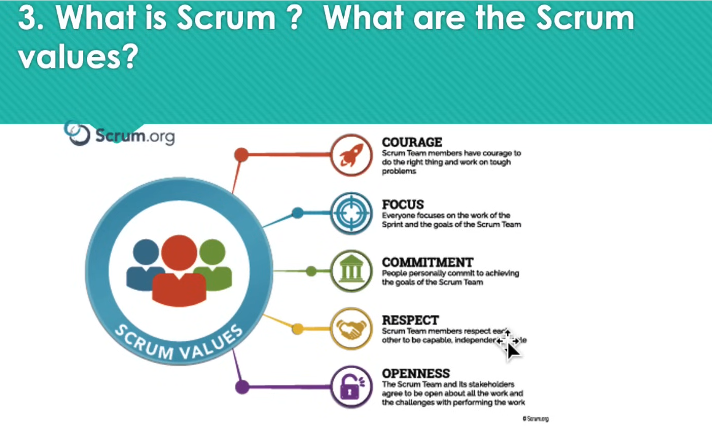

# Business Analyst (BA) - YouTube Course Notes

## Types of Business Analysts

### 1. Vanilla BA
- Focus: Gathering requirements, not developing or delving deep into IT.
- Key Deliverables: 
  - **BRD** (Business Requirements Document)
  - **FRD** (Functional Requirements Document)
  - **SRS** (Software Requirements Specification)

### 2. System Analyst Level BA
- Focus: IT solutions and testing within an Agile environment.
- Key Deliverables: 
  - **User Stories**
  - **Data Flow Diagrams**
  - Testing (UAT, SIT)

## Essential BA Skills
1. **Requirement Gathering Skills** - Understanding and documenting client needs.
2. **Documentation** - Creating reports and specifications.
3. **Data Flow Diagrams** - Visual representation of system processes.
4. **Software Development Knowledge** - Familiarity with Agile and Waterfall methodologies.

## Project Environments
1. **Dev** - Development environment where developers build the application.
2. **QA** - Quality Assurance for testers to validate functionality.
3. **UAT** - User Acceptance Testing, where business users test the application.
4. **PROD** - Production environment accessible to end users.

## Types of Projects
1. **New** - Building from scratch.
2. **Enhancement** - Improving or adding features to existing systems.

## Importance of Agendas
- Set agendas for every meeting to avoid wasting stakeholders' time.
- Clearly outline meeting objectives and participants.
- Helps maintain professionalism and focus.

## Email Handling Best Practices
- Record calls (with permission) when they contain significant information.
- Document all discussions and decisions.
- Involve technical team members when needed for clarity.

## Analysis Techniques

### SWOT Analysis
- **S**trengths: Internal advantages.
- **W**eaknesses: Internal challenges.
- **O**pportunities: External factors to capitalize on.
- **T**hreats: External risks to mitigate.

### MOST Analysis
- **Mission**: Why the business exists.
- **Objectives**: Goals to achieve the mission.
- **Strategies**: Plans to meet objectives.
- **Tactics**: Specific actions to implement strategies.

### Business Process Modeling (BPM)
- Visual representation of business processes from start to finish.
- Tools:
  - **Flowcharts**
  - **Data Flow Diagrams**
  - **Mind Maps**
- Difference: BPM includes more detailed data compared to flowcharts.
- To create a new BPM, understand the current flow and use **BPMN** symbols and notations.
- **Tip:** Add BPMN skills to your CV.

### PESTLE Analysis
- **P**olitical: Impact of government policies.
- **E**conomic: Market trends and economic factors.
- **S**ocial: Cultural and societal influences.
- **T**echnological: Innovations affecting the business.
- **L**egal: Regulations and compliance.
- **E**nvironmental: Sustainability and ecological considerations.

**Example:**
- **Industry:** Retail expansion.
- **Key Consideration:** Adapting to local regulations and cultural preferences while ensuring technological competitiveness.

### CATWOE Analysis
- **C**lients: Who benefits from the system?
- **A**ctors: Who implements the process?
- **T**ransformation Process: What is changing?
- **W**orldview: What is the bigger picture?
- **O**wners: Who has control?
- **E**nvironmental Constraints: External limitations.

**Case Study Example:**
- **Scenario:** Implementing a new CRM system.
- **Conflict:** Stakeholders have differing views on priorities.
- **Resolution:** Use CATWOE to identify key players and align requirements.

## Additional Tips
- During brainstorming sessions, be prepared to mediate conflicts between stakeholders.
- Always provide clear and accurate data to IT teams to support decision-making.
- Focus on building professional communication skills for handling clients and stakeholders effectively.

# Business Analysis Notes

## MOSCOW Technique

- **Must Have**: Vital requirements/features that cannot be avoided.
- **Should Have**: Significant tasks but not critical to project success.
- **Could Have**: Nice to have but not mandatory.
- **Won't Have**: Not required at the moment.

---

## Use Case Modeling
- Defining requirements using UML diagrams.  
  **Note**: You need to learn this.

### UML Diagram
A guidebook for software development:

- **Benefits**:
  - Reduces errors.
  - Improves understanding.
  

### Types of UML Diagrams

---

## Root Cause Analysis: Five Whys Technique

---

## Mind Mapping

---

## Connect with PR Works
- **Elicitation (Requirement Gathering)**: Collect and analyze requirements.
  - Example: Handle and analyze a large number of requirements.
  - **Tip**: Focus on meaningful insights.

### Case Study

---

## Software Development Life Cycle (SDLC)
### Waterfall Model
- Sequential process:
  1. BA gathers requirements → BRD, FRD, SRS.
  2. Development → 1 month.
  3. Testing (QA/SIT) → 1 month.
  4. UAT → 2 weeks.
  5. Production → Go Live.
  
**Metaphor**: Delivering the entire house after 5 months without client involvement.

---

### Agile Model
- Iterative process with 4-week sprints:
  - Create **User Stories** (see below).
  - Frequent feedback from clients.
  

**Metaphor**: Delivering a house room-by-room with constant client feedback.

#### Agile vs. Waterfall in SDLC

- **Waterfall**: BRD, FRD, SRS, RTM, SIT Test Plan, UAT Test Plan, Lessons Learned Document.
- **Agile**: User Stories, Sprint Planning, Retrospective Document, JIRA/Confluence tools.

---

## User Stories

- **Definition**: Informal explanation of a software feature from the end user's perspective.
- **Format**: 
  > "As a [persona], I [want to], [so that]."

#### Components:
- **Story Point**: Time estimate for development.
- **Sub-task**: Smaller units within a story.

### Epics vs. User Stories vs. Tasks
- **Epics**: Large, complex collections of user stories.
- **User Stories**: Business requirements from the end-user perspective.
- **Tasks**: Smallest units, breaking down user stories further.

---

## Practical Advice
- Record calls to create user stories immediately.
- BA performs **UAT (User Acceptance Testing)**:
  - If defects occur, they are logged in JIRA for resolution.

---

## Agile Roles & Responsibilities
- **Analyzing Business Processes**: Identify areas needing improvement.
- **Proposing Solutions**: Develop actionable strategies.
- **Creating User Stories/Tasks**: Prioritize user needs.
- **Stakeholder Management**: Balance requirements and resolve conflicts.
- **Sustainable Development**: Promote collaboration and adaptability.

---

## Agile Manifesto
1. **Individuals and interactions** over processes and tools.
2. **Working software** over comprehensive documentation.
3. **Customer collaboration** over contract negotiation.
4. **Responding to change** over following a plan.

### Principles
- Deliver value continuously and early.
- Embrace changing requirements.
- Foster collaboration and motivated teams.
- Promote simplicity and sustainable development.
- Reflect and improve at regular intervals.

---

## Scrum Overview
- **Definition**: Framework within Agile methodology.
- **Roles**: Scrum Master, Product Owner, Developers.
- **Values**: Commitment, Courage, Focus, Openness, Respect.

### User Stories in Scrum

---

## Conflict Management in Agile Teams
- Stick together, acknowledge individual skills, and respect differences.
- Look for ways to support and help each other.

---

## Tools for BA
- **Documentation**: JIRA, Confluence.
- **Artifacts**: BRD, Diagrams, Sprint Planning Docs, Retrospectives.

Business Analysis Foundations
Completed a course covering requirement elicitation, user stories, MoSCoW prioritization, and Agile methodologies. Gained skills in UML diagrams, root cause analysis, UAT, and tools like JIRA and Confluence to support stakeholder collaboration and process improvement